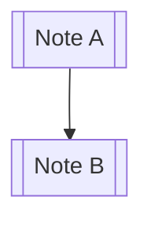

# Obsidian Flavored Markdown

Obsidian extends standard Markdown (CommonMark + GitHub Flavored Markdown) with syntax for connecting and enriching notes: wikilinks, embeds, callouts, block references, tags, comments, highlights, and math.

When creating or editing notes, use the `write_file` tool for note bodies and the `update_frontmatter` tool for properties. Place all body content **after** the YAML frontmatter block (if present) — frontmatter must start with `---` on line 1 and end with a closing `---`.

## Internal Links (Wikilinks)

Link to other notes by title — no path or extension needed unless disambiguating:

| Syntax                        | Meaning                               |
| ----------------------------- | ------------------------------------- |
| `[[Note Name]]`               | Link by note title                    |
| `[[Note Name\|Display Text]]` | Custom display text                   |
| `[[Note Name#Heading]]`       | Link to a heading within a note       |
| `[[Note Name#^block-id]]`     | Link to a specific block              |
| `[[#Heading]]`                | Link to a heading in the current note |
| `[[folder/Note Name]]`        | Disambiguate when titles collide      |

Wikilinks are the preferred linking style in Obsidian. Standard Markdown links (`[text](path)`) also work, but wikilinks integrate with the graph view, backlinks, and autocomplete.

### Block References

Append a caret + identifier to the end of any block (paragraph, list item, etc.) to give it a stable anchor, then link to it:

```markdown
This is an important paragraph. ^key-point

See [[Other Note#^key-point]] for context.
```

Block IDs may contain letters, numbers, and hyphens. Obsidian auto-generates one (e.g. `^a1b2c3`) if you link to a block before naming it.

## Embeds

Prefix any wikilink with `!` to embed the target's content inline instead of linking to it:

| Syntax                     | Meaning                       |
| -------------------------- | ----------------------------- |
| `![[Note Name]]`           | Embed an entire note          |
| `![[Note Name#Heading]]`   | Embed one section             |
| `![[Note Name#^block-id]]` | Embed a single block          |
| `![[image.png]]`           | Embed an image                |
| `![[image.png\|300]]`      | Embed an image at 300px width |
| `![[image.png\|300x200]]`  | Width x height                |
| `![[document.pdf]]`        | Embed a PDF                   |
| `![[document.pdf#page=3]]` | Embed a specific PDF page     |
| `![[recording.mp3]]`       | Embed audio                   |
| `![[clip.mp4]]`            | Embed video                   |

Embeds only render in Reading view and Live Preview — they appear as raw `![[...]]` text in Source mode. After adding embeds, let the user know they may need Reading view to see them rendered.

## Callouts

Callouts are styled blockquotes for admonitions. Structure: a blockquote whose first line is `> [!type]`, optionally followed by a custom title:

```markdown
> [!note]
> This is a note callout with default title.

> [!warning] Custom Title
> This callout has a custom title.

> [!tip]+ Expanded by default
> The `+` makes a foldable callout that starts open.

> [!info]- Collapsed by default
> The `-` makes a foldable callout that starts closed.
```

Built-in types (each has its own icon/color): `note`, `abstract`/`summary`/`tldr`, `info`, `todo`, `tip`/`hint`/`important`, `success`/`check`/`done`, `question`/`help`/`faq`, `warning`/`caution`/`attention`, `failure`/`fail`/`missing`, `danger`/`error`, `bug`, `example`, `quote`/`cite`. Unknown types fall back to the `note` style. Callouts can be nested by adding more `>` levels, and may contain any Markdown, including wikilinks and embeds.

## Properties (Frontmatter)

YAML metadata at the very top of a note. **Always use the `update_frontmatter` tool** to add or change properties — it formats YAML safely via Obsidian's API rather than hand-editing the block.

```yaml
---
title: My Note
tags:
  - project
  - active
aliases:
  - Alt Name
date: 2026-06-09
cssclasses:
  - wide-page
---
```

For full guidance on property types (text, list, number, checkbox, date, datetime) and their interaction with Bases, Templates, and Search, activate the `obsidian-properties` skill.

## Tags

Inline `#tags` categorize notes and can be nested with `/`:

```markdown
#project #status/active #area/work
```

Tags can also live in frontmatter under the `tags` property (without the `#`). Tags may contain letters, numbers, `-`, `_`, and `/`, but not spaces, and cannot be purely numeric.

## Comments

Text wrapped in `%%` is hidden from Reading view but stays in the file:

```markdown
%%This is a private note that won't render.%%

Visible text %%inline hidden%% more visible text.
```

## Other Syntax

| Feature     | Syntax                                                        |
| ----------- | ------------------------------------------------------------- |
| Highlight   | `==highlighted text==`                                        |
| Inline math | `$e = mc^2$`                                                  |
| Block math  | `$$\int_a^b f(x)\,dx$$` on its own line                       |
| Footnote    | `Some text.[^1]` then `[^1]: The definition.` on its own line |

Mermaid diagrams render from a fenced `mermaid` code block and support wikilinks between nodes:



Standard GitHub Flavored Markdown — tables, task lists (`- [ ]` / `- [x]`), fenced code blocks, strikethrough (`~~text~~`) — all work as expected.

## Workflow

1. If the note needs metadata, add frontmatter first via `update_frontmatter`.
2. Write the body with `write_file`, placing content after any frontmatter.
3. Use wikilinks to connect related notes and embeds to pull in supporting content.
4. Remind the user that embeds and callouts render in Reading view / Live Preview, not Source mode.

## Tips

- Prefer `[[wikilinks]]` over Markdown links so the note participates in the graph and backlinks.
- When linking to a heading or block that doesn't exist yet, create the anchor in the target note so the link resolves.
- Keep callout types lowercase; the title after `[!type]` is free-form text.
- Don't place body content before frontmatter unless explicitly editing the frontmatter block.
